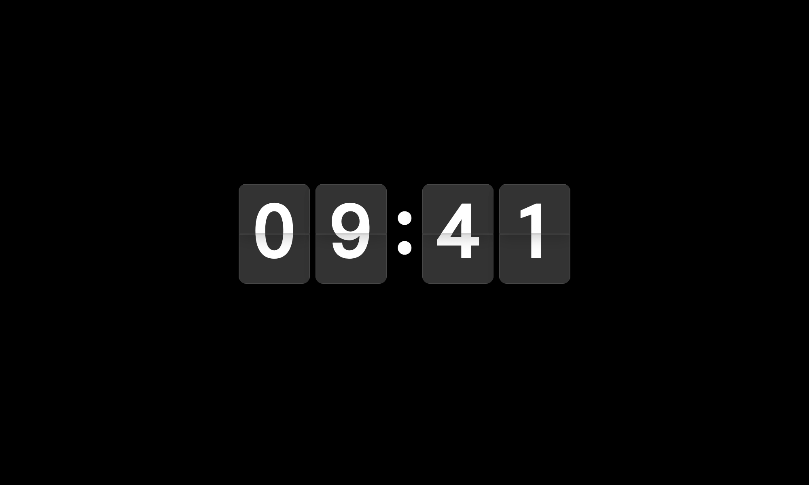

# macOS 플립 시계

SwiftUI 기반의 macOS용 커스텀 플립 시계 애플리케이션

[English Version](./README.md)

## 주요 기능

- **전역 단축키**: 앱 비활성 상태에서도 `Cmd + Ctrl + S`로 화면보호기 모드 즉시 실행 (Carbon API)
- **시각 커스터마이징**: 시스템 설치 폰트 연동, 리퀴드 글래스 효과, 입체 그림자 설정 지원
- **배경 모드**: 단색, 그라데이션, 로컬 이미지(WebP/HEIC), 온라인 이미지 및 웹사이트 URL 배경 지원
- **프리셋 관리**: 사용자 정의 테마를 독립적인 프리셋으로 저장 및 로드
- **멀티 모니터**: 주 모니터 또는 연결된 모든 모니터에 시계 동시 출력
- **다국어 지원**: 영어 및 한국어 UI 공식 지원
- **시스템 연동**: 로그인 시 자동 실행, 메뉴바 아이콘 제어, Dock 아이콘 숨기기 옵션 제공

## 기술 스택

- Swift / SwiftUI
- Combine (상태 및 설정 관리)
- Carbon Framework (시스템 전역 핫키)
- WebKit (웹 기반 배경 렌더링)
- ServiceManagement (로그인 항목 등록)

## 저작권

© 2026 orion-gz. All rights reserved.
