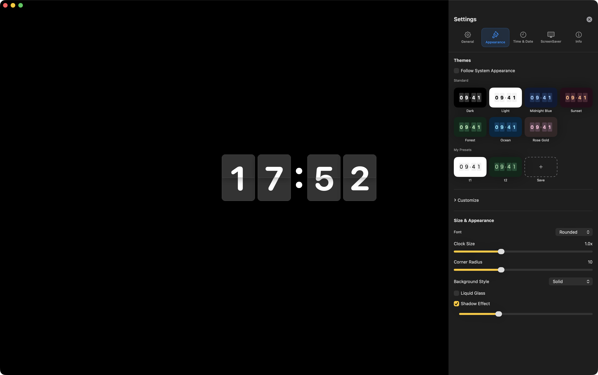
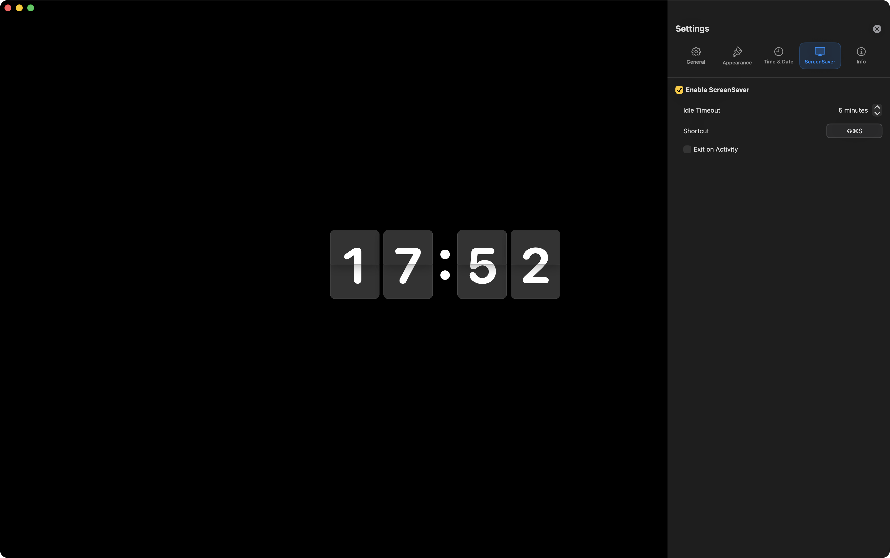

# macOS Flip Clock

A highly customizable native Flip Clock application for macOS built with SwiftUI.

[🇰🇷 한국어 버전](./README.ko.md)

## Features

- **Global Hotkey**: Launch ScreenSaver mode via `Cmd + Ctrl + S` from any application (Carbon API).
- **Extreme Customization**: Adjust scale for Clock, Date, Seconds, and AM/PM independently with 0.05 precision.
- **Font Flexibility**: Use any system-installed font for both clock and date separately.
- **Design FX**: Customizable Liquid Glass texture, shadow intensity, and corner radius.
- **Backgrounds**: Supports Solid colors, Gradients, Local/Online Images (WebP/HEIC), and live Website URLs.
- **Advanced Presets**: Save multiple design configurations with individual font and style settings.
- **Multi-monitor**: Intelligent display management – show on primary screen during work, fill all screens in ScreenSaver mode.
- **Update Engine**: Built-in version checker via GitHub API with configurable frequency and snackbar notifications.
- **System Integration**: Native support for English/Korean, Launch at login, and Dock/Menu Bar icon visibility control.

## Images & Videos

<b>📷 Screenshots (Click to expand)</b>

### Main View

### Settings - General

### Settings - Appearance

### Settings - Time & Date

### Settings - ScreenSaver

<b>🎥 Videos (Click to expand)</b>

### Flip Animation
[Watch Video](./Videos/flip_animation.mov)

### Theme Customization
[Watch Video](./Videos/customize_theme.mov)

### Time & Date Settings
[Watch Video](./Videos/customize_time_date.mov)

## Tech Stack

- Swift / SwiftUI
- Combine (State management)
- Carbon Framework (Global hotkeys)
- WebKit (Web backgrounds)
- ServiceManagement (Login items)

## License

© 2026 orion-gz. All rights reserved.
